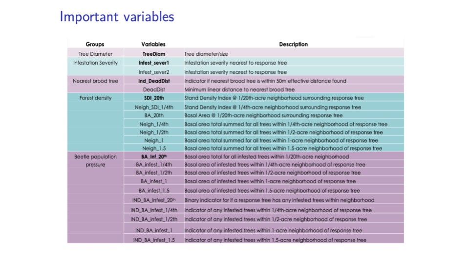

# Project 1

## Data Science 2 {style="color: #808080"}

## HGEN 612 {style="color: #808080"}

 

### Assignment Summary {style="color: #606060"}

Create a data product to communicate key features of an analysis project. The end users of the app are your collaborators who require an informative, but succinct, overview of the research project progress. Imagine this as a visual project summary your collaborators can use as a reference and to generate insight. Each display item should include a title and/or subtitle that indicates its purpose and, as applicable, the take-home message. The motivation for the analysis is to use the information in the 'pine beetle' dataset to predict the minimum linear distance to the nearest brood tree (`DeadDist`).

### Grading {style="color: #606060"}

Your data product must include the following [100 total points]:

-   [05] The app should be a designed and rendered as a flexdashboard. Do not use Shiny widgets.
-   [10] Include 6-10 display items.
-   [20] Apply at least 2 different types of statistic modeling approaches.
-   [05] Model specification should be done in the tidymodels framework.
-   [05] Feature engineer the data as applicable using `step_x` functions.
-   [05] Use a recipe.
-   [05] Use a tidymodels workflow.
-   [10] Provide an evaluation of your models.
-   [05] At least 1 display item should showcase the data.
-   [05] At least 1 display item should showcase the predictors used in each model.
-   [05] At least 1 display item should showcase model results.
-   [05] Embed the code within the app.
-   [10] Aesthetics (i.e., start with a good theme). 
-   [05] Publish the app to Rpubs and send Dr. York and Dr. Lapato the link as a direct message in Slack.

### Notes {style="color: #606060"}

-   Late assignments will not be accepted.
-   I suggest reviewing all code and presentations before beginning assignment. Don't forget all the great resources at https://rmarkdown.rstudio.com/flexdashboard/index.html
-   All work should be done independently. You can use web resources (e.g., StackOverflow).
-   You can ask coding questions to the class on the #hgen-612 channel (e.g., "can anyone help debug this code snippet.." ).
-   Limit the amount of textual descriptions so that they do not overcrowd the display.
-   Text related to model output (e.g., from `broom`) is not considered a textual description, though it should be appropriately tidied.
-   Be creative but remember your audience. i.e., do not use extraneous colors in graphs.
-   Feel free to explore all that HTML widgets have to offer (e.g., Plotly).
-   You are not limited to the 4 predictor variables used in class so feel free to explore additional variables (see Dr. Smirnova's slide below).

{width="75%"}
